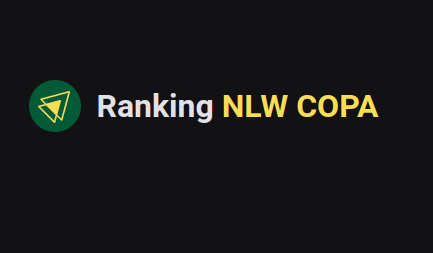

  

  # NLW RANKING
  Trata- se uma aplicação que foi desenvolvida apenas como estudo e diversão para monitorar o número de indicações do alunos para o NLW COPA, evento promovido pela escola de desenvolvimento [Rocketseat](https://www.rocketseat.com.br/). Como forma de incentivo a escola tem um programa de indicações que premia os alunos que mais convidam outros alunos para o evento e a ideia aqui foi criar um ranking com essas informações.

  

  
  
  
   

Aplicações

### Back-End

O back-end foi feito em NodeJS utilizando Express para levantar o servidor, Axios para realizar as chamadas http ao endpoint da Rocket, Postgress para o banco de dados e Prisma como ORM para comunicar com o banco.

para que eu pudesse hopedar no Railway, utilizei a minha outra conta do github para hospedar o codigo do back mas pode ser clonado através desse link  [NLWRankingServer](https://github.com/maykonsousapb/nlwRankingServer)

### Front-End

O FrontEnd foi foi construído em React, utilizando Typescript, ContextApi para gerenciamento de estado global, Styled Components para estilização e Axios para comunicação com o nosso backend

***
## Regras de negócio

- O cadastro deverá ser feito utilizando o nome de usuário contido na url de convite da Rocketseat: exemplo [https://nlw.rocketseat.com.br/convite/maykon-216](https://nlw.rocketseat.com.br/convite/maykon-216)
- Só poderão ser cadastrados usuários previamente iscritos no evento da Rocketseat
- O Ranking será organizado levando em consideração apenas os usuários cadastrados na plataforma
- Na tabela de ranking será possivel acessar o ticket do usuário para obter informações como nome, trilha que fará no evento e confirmar o número de indicações

***

## Links

**website**:[https://nlwranking.vercel.app/](https://nlwranking.vercel.app/)

***
## CONTATOS

**Portifolio**:[http://maykonsousa.github.io](http://maykonsousa.github.io/)
**LinkedIn**: [https://www.linkedin.com/in/maykonsousa](https://www.linkedin.com/in/maykonsousa/)
**Whatsapp**: 61 992943297
